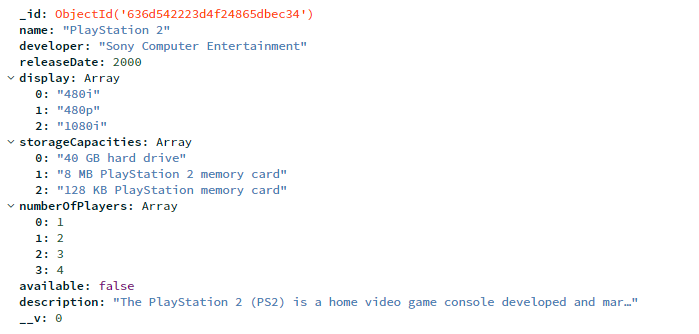
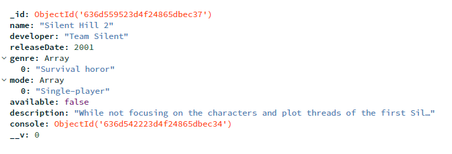

<h1 align="center">
  
</h1>

# Projeto Guiado III - CRUD com Banco de Dados

Turma Online 19 - Todas em Tech  | Back-end | Semana 13 | 2022 | Gaia Maria

##   Apresentação e Justificativa

 Olá, meu nome é Laura Rocha. Sou uma mulher trans não binária graduada em Biomedicina (UEM). Costumo me definir pelos meus interesses, que são extremamente diversos, incluindo jogos, livros, filmes, séries, animes & mangás e descobrir novos artistas e bandas. Sou entusiasta do terror e do experimental em todo o tipo de mídia. Dito isso, não é nada surpreendente que meu console favorito escolhido para realizar a atividade do projeto guiado dessa semana, em banco de dados, tenha sido o PlayStation 2. Uma das plataformas de jogos eletrônicos mais populares que já existiram e detentor do recorde de console mais vendido da história, o PS2 foi responsável por um significante salto tecnológico em relação à geração anterior, o que permitiu que estúdios e desenvolvedores experimentassem com diversas mecânicas e ferramentas, além de ter sido o modelo que viu um dos maiores números de lançamentos do gênero de *survival horror*, devido a alta popularidade deste no início do século. Quanto ao jogo escolhido, minha história com Silent Hill se inicia ainda na geração anterior com o primeiro título da franquia: por volta dos 8 anos (sem acesso à internet para saber sobre jogos que não tivesse já jogado ou ouvido falar sobre, e sem nenhum conhecimento no idioma inglês) acabei entrando em contato com Silent Hill e verdadeiramente marcada pela experiência. Sempre relembrando tal evento até decidir se aventurar pelas ruas enevoadas da cidade silenciosa novamente, duramente minha adolescência.
  
  

<h1 align="center">
  
</h1>

<h1 align="center">
  
</h1>

<h1 align="center">
  
</h1>

Desenvolvido com :purple_heart:  

