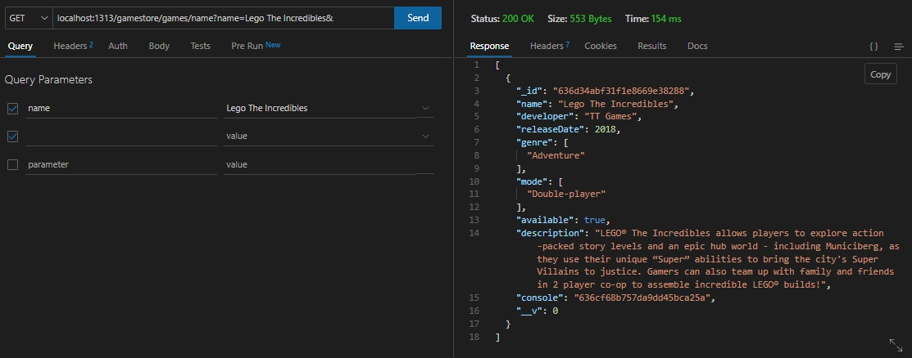
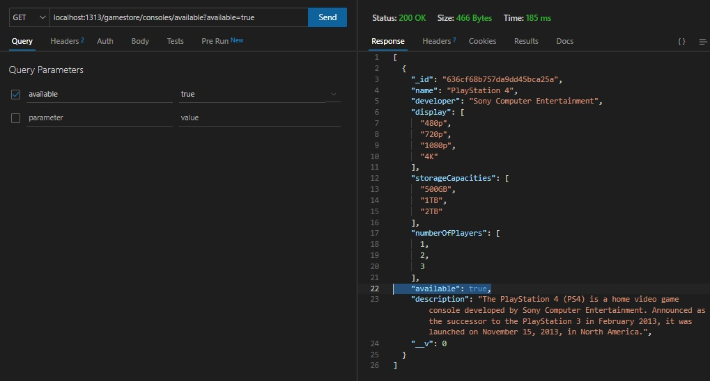
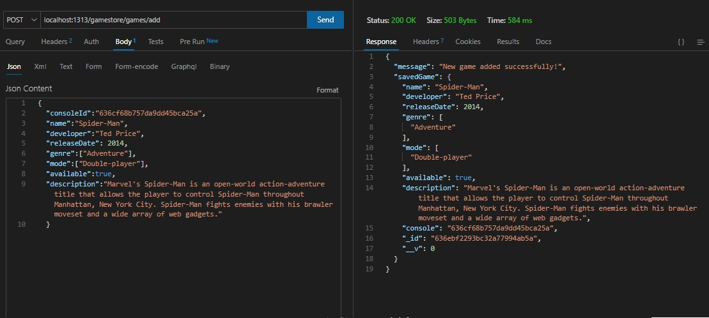
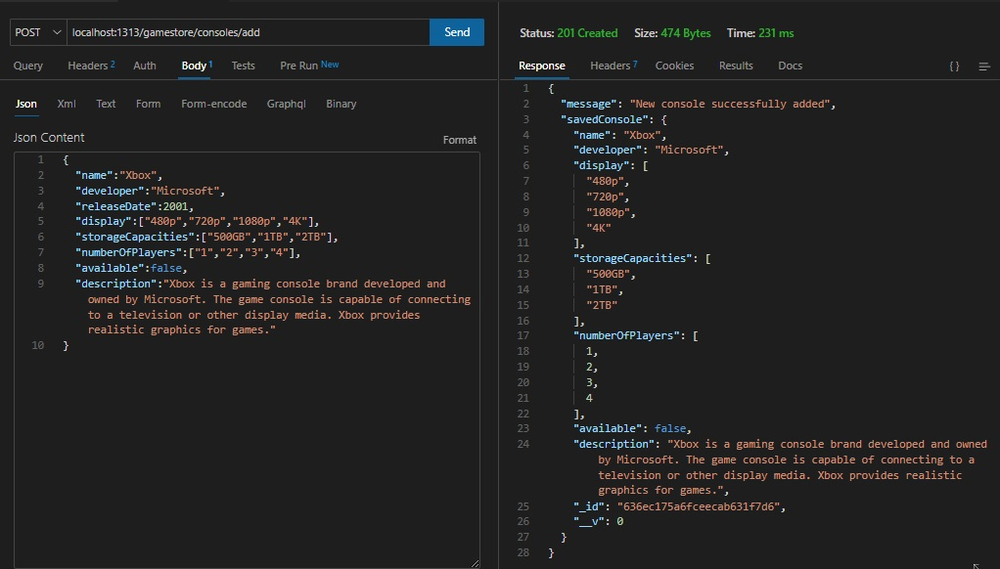

# Exercício de Sala 🏫  

* realizar importação do model
* criar uma const:
 1- que encontre todos os consoles - get
 2- encontre console por ID - get

# Exercício para Casa 🏫  
- Termine o codigo, caso tenha faltado alguma informação;
- Como atividade de casa eu quero que vocês cadastrem o jogo favorito de vocês e adicionem como imagem aqui no readme.

<h1 align="center">
  

</h1>

Oie maravilhosas, vamos de tarefinha.
Essa semana vocês foram salvas pela Jani, agradeçam muito a ela kkkkkkk Então vamos la:  

* Crie uma rota *GET* que encontre um jogo usando como parametro  name (crie a logica na pasta controller);

<h1 align="center">
  

</h1>

* Crie uma rota *GET* que encontre um console usando como parametro available (crie a logica na pasta controller);

<h1 align="center">
  

</h1>

* Cadastre no seu banco de dados um novo jogo e/ou um novo console (a sua escolha), tire um print da tela e adicione essa imagem no seu *README.md* isso servirá como comprovante pessoal de que todo seu codigo esta funcionando. 

Adicionado novo game:

<h1 align="center">
  

</h1>

Adicionado novo console:

<h1 align="center">
  

</h1>

* Opicional (não conta como avaliação): Crie uma *rota GET* para genre em jogos e uma *rota GET* para developer em consoles.

## Nome do Exercicio

- Explicação do exercício: Lorem ipsum dolor sit amet, consectetur adipiscing elit. Aliquam leo nibh, tempus sed rhoncus et, ultrices vitae orci.
Donec erat mauris, laoreet in tortor vel, eleifend suscipit nibh. Lorem ipsum dolor sit amet, consectetur adipiscing elit.
Aliquam leo nibh, tempus sed rhoncus et, ultrices vitae orci. Donec erat mauris, laoreet in tortor vel, eleifend suscipit nibh. 
---

Terminou o exercício? Dá uma olhada nessa checklist e confere se tá tudo certinho, combinado?!

- [x] Fiz o fork do repositório.
- [x] Clonei o fork na minha máquina (`git clone url-do-meu-fork`).
- [x] Resolvi o exercício.
- [x] Adicionei as mudanças. (`git add .` para adicionar todos os arquivos, ou `git add nome_do_arquivo` para adicionar um arquivo específico)
- [x] Commitei a cada mudança significativa ou na finalização do exercício (`git commit -m "Mensagem do commit"`)
- [x] Pushei os commits na minha branch (`git push origin nome-da-branch`)
